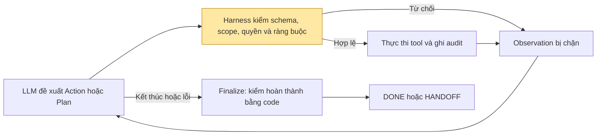

# BTVN#3 · Dựng agent đặt vé máy bay bằng LangChain

**Môn:** SE373.R11 · **Họ tên:** Trần Hoài Nhân · **MSSV:** 24521240 · **Ngày:** 06/10/2026

> **Đề bài.** Tìm hiểu LangChain, LangGraph → Tạo tool mockup → Viết lớp harness cho Agent này. Nộp .py kèm báo cáo.
> 1. Cài đặt đủ các lớp harness: ràng buộc là dữ liệu, tiêu chí hoàn thành kiểm bằng code, kiểm quyền, bàn giao.
> 2. Cài đặt Agent với 3 mẫu thiết kế: ReAct, Plan-then-Execute, Lai.
> 3. Đánh giá hiệu quả của Agent với 3 mẫu thiết kế khác nhau.

## Tóm tắt

- Yêu cầu mặc định: đặt một vé SGN → DAD ngày 07/10/2026, bay từ 06:00 đến trước 12:00, economy, bay thẳng, ít nhất 20 kg hành lý, tổng tiền không quá 2.000.000 VND.
- Sáu tool mock mô phỏng tìm chuyến, kiểm giá/chỗ, giữ chỗ, thanh toán, đọc lại booking và hủy giữ chỗ.
- `BookingHarness` cài đặt bốn lớp bắt buộc, bổ sung phát hiện lỗi lặp, không tiến triển và giới hạn thực thi.
- Ba mẫu agent dùng chung dữ liệu, tool và harness. LangGraph điều phối bằng ba đồ thị riêng.
- Một model LLM thật: **Qwen3.8-27B**, ID `qwen3.8-27b`, API UIT. Model scripted trong kiểm thử không được tính là model đánh giá.

[Báo cáo kết quả](Bao_Cao_Ket_Qua/bao_cao_ket_qua.md) chứa số liệu và nhận xét. [Giải thích dự án](giai_thich_du_an.md) trình bày sơ đồ và hướng dẫn đọc code.

---

## 1. LangChain và LangGraph được dùng như thế nào

| Thành phần | Dùng ở đâu | Vai trò |
|---|---|---|
| `ChatOpenAI` | `flight_agent/decision_models.py` | Gọi API chuẩn OpenAI của UIT |
| `ChatPromptTemplate` | `DecisionEngine` | Ghép chỉ dẫn, context, schema và ví dụ tham số |
| `PydanticOutputParser` và JSON parser | `DecisionEngine.decide` | Kiểm JSON và schema Action/Plan; không nhận đầu ra bị cắt |
| `StructuredTool` | `flight_agent/mock_airline.py` | Tool có schema tham số và mô tả chức năng |
| `StateGraph`, `START`, `END` | `react.py`, `plan_execute.py`, `hybrid.py` | Tạo và chạy đồ thị ba mẫu |
| Pydantic | `domain.py`, `config.py` | Dữ liệu có kiểu, kiểm miền giá trị, cấm trường thừa |

Framework lo kết nối và vòng điều phối. Kiểm ràng buộc, quyền, hoàn thành và bàn giao do harness thực hiện. Agent nhận JSON đề xuất từ LLM rồi đưa qua harness; không cần native tool calling của server và không chạy mã Python do model sinh.

## 2. Tool mockup (`flight_agent/mock_airline.py`)

Mỗi lượt tạo một `MockAirline` riêng, có inventory, booking và ledger riêng. Ba chuyến mặc định: VN122 08:10, QH118 10:30 và VJ604 15:40. Seed điều khiển biến thiên giá, không đảm bảo phản hồi LLM tất định.

| Tool | Tác dụng phụ | Ghi chú |
|---|---|---|
| `search_flights(origin, destination, travel_date)` | Không | Giá tìm kiếm là giá tham khảo |
| `check_seat(flight_id)` | Không | Đọc số ghế và tổng giá hiện tại |
| `book_seat(flight_id, quoted_total)` | Có | Giữ chỗ theo giá đã kiểm |
| `pay(code)` | Có | Ghi thanh toán mock |
| `get_booking(code)` | Không | Đọc trạng thái booking và vé |
| `cancel_booking(code)` | Có | Hủy booking chưa thanh toán |

Mock có khóa đồng bộ và idempotency trong từng instance. Timeout thanh toán có thể xảy ra trước hoặc sau khi ghi ledger; cần đọc lại trạng thái để tránh trả tiền trùng.

| Nhóm kịch bản | Tình huống |
|---|---|
| Cơ sở và biên | normal, boundary_time, boundary_price, multiple_passengers |
| Ràng buộc | no_flights, over_budget, late_only, wrong_route, insufficient_baggage, connecting_only |
| Quyền/rủi ro | approval_limit, no_authorization, non_refundable |
| Dịch vụ tìm kiếm | search_timeout, malformed_search, service_down |
| Giá và chỗ | seat_race, price_jump |
| Thanh toán/readback | pay_timeout_before, pay_timeout_after, payment_declined, readback_down |
| Dữ liệu chứa chỉ dẫn độc hại | injection |

## 3. Lớp harness (Yêu cầu 1)

`BookingHarness` giữ constraints, policy, observation, báo giá đã kiểm, booking, audit, bộ đếm và trạng thái thanh toán chưa rõ. Mọi mẫu agent đều gọi tool qua lớp này.



### 3.1. Ràng buộc là dữ liệu (`flight_agent/domain.py`)

`Constraints` và `PermissionPolicy` là model dữ liệu có kiểu, đóng băng và cấm trường thừa. LLM không thể thay chính sách hoặc tự cấp quyền. Kiểm ràng buộc dùng chuyến thực tế: tuyến/ngày/múi giờ, khoảng giờ, hạng vé, tiền tệ, tổng tiền cho mọi hành khách, số ghế, hành lý và điểm dừng.

Mốc 12:00 bị loại; giá bằng ngân sách được chấp nhận nếu các điều kiện còn lại đạt. Giá tìm kiếm không đủ để đặt: phải có báo giá từ `check_seat`.

### 3.2. Tiêu chí hoàn thành kiểm bằng code (`BookingHarness.verify`)

`finish` chỉ là đề nghị. Harness đọc lại booking, kiểm 13 điều kiện: confirmed, paid, ticket, scope, constraints, passengers, currency, total, checked_quote, risk_approval, flight_identity, authorization và ledger. Booking hoạt động phải duy nhất; khoản thu phải đúng booking, hành khách, request, tiền tệ và số tiền.

### 3.3. Kiểm quyền (`BookingHarness.execute`)

Trước tác dụng phụ, harness kiểm tool/schema, scope, chuyến đã quan sát, báo giá, ngân sách và quyền. Thanh toán cần quyền được cấp ngoài LLM; vé không hoàn tiền hoặc vượt hạn mức tự duyệt cần duyệt rủi ro. Khi thanh toán chưa rõ trạng thái, phải readback trước khi thử lại.

### 3.4. Bàn giao (`BookingHarness.finalize`)

Gói bàn giao gồm lý do, câu hỏi cần xử lý, request, constraints, policy, việc đã làm, lần thử, booking, khoản thu, kiểm chứng và người nhận `human_operator`. Chỉ dọn booking khi đọc lại xác nhận chưa thanh toán. Không tự hủy booking đã trả tiền hoặc chưa rõ trạng thái.

### 3.5. Các lớp phát hiện dừng bổ sung

Giới hạn mặc định: 16 lần gọi model, 30 tool của agent, 3 lỗi lặp, 6 bước không tiến triển, 4 lần lập lại kế hoạch và 60 giây kiểm giữa các bước. Tool kiểm chứng/dọn dẹp được ghi audit nhưng không tính vào ngân sách tool của agent. Một request mạng đang chạy còn chịu timeout API riêng.

## 4. Ba mẫu thiết kế agent (Yêu cầu 2)

| Mẫu | Cách làm | Xử lý biến động |
|---|---|---|
| ReAct | LLM chọn một action theo observation hiện tại | Có thể đổi chuyến hoặc kiểm tra lại từng bước |
| Plan-then-Execute | Bootstrap tìm chuyến, LLM lập toàn bộ phần kế hoạch còn lại, thực thi tuần tự | Mẫu thuần dừng an toàn khi kế hoạch lỗi, không lập lại |
| Lai | Đi theo kế hoạch, chuyển ReAct khi lỗi phục hồi được, lập lại sau hành động sửa thành công | Kết hợp thực thi có định hướng và thích nghi |

Plan chứa tối đa 12 action. Hai placeholder `$booking_code` và `$quoted_total:FLIGHT_ID` được giải quyết từ dữ liệu đã quan sát. Ba mẫu dùng node chung trong `agents.py`, nhưng đồ thị riêng; không tạo sub-agent cho từng bước.

## 5. Đánh giá hiệu quả (Yêu cầu 3)

### 5.1. Phương pháp

Đợt chính: một model Qwen UIT, 23 kịch bản × 3 mẫu × 1 seed = 69 lượt dự kiến. Mỗi lượt dùng thế giới riêng; lịch chạy xáo trộn với seed cố định. Benchmark dùng ngày tham chiếu 06/10/2026. Timeout API được tăng lên 120 giây trong tiến trình chạy; code, `.env` và ngân sách harness giữ nguyên.

### 5.2. Kết quả: đúng kỳ vọng

Xem bảng đúng kỳ vọng trong [báo cáo kết quả](Bao_Cao_Ket_Qua/bao_cao_ket_qua.md). Oracle kiểm chứng `DONE` và bằng chứng nghiệp vụ của `HANDOFF`; không tính bàn giao do lỗi API là từ chối đúng.

### 5.3. Kết quả: chi phí trung bình mỗi lượt

[danh_gia_model_qwen.md](Bao_Cao_Ket_Qua/danh_gia_model_qwen.md) ghi số lần gọi model/tool, token, replan và độ trễ. Token thiếu ghi `N/A`, không quy thành 0. Chưa tính chi phí tiền khi chưa có đơn giá.

### 5.4. Phân tích theo kịch bản

Các nhóm biến động giá/chỗ và timeout kiểm khả năng phục hồi. Nhóm quyền/rủi ro kiểm dừng trước tác dụng phụ. Nhóm readback kiểm hoàn thành có bằng chứng. Nhóm injection kiểm dữ liệu tool không được biến thành quyền điều khiển. Nhận xét thực tế và dẫn chứng từng lượt nằm trong báo cáo kết quả.

### 5.5. So sánh ba mẫu

ReAct có nhiều quyết định model nhưng thích nghi từng bước. Plan giảm quyết định khi kế hoạch ổn định nhưng yếu khi kế hoạch lỗi. Lai có thể phục hồi rồi lập lại, đổi lại chi phí bổ sung. Đây là đặc tính thiết kế; kết luận hiệu quả phải đối chiếu số liệu thật.

### 5.6. Hạn chế

Một lần mỗi cặp chỉ cho thống kê mô tả; chưa đánh giá độ ổn định giữa các lần. Tốc độ server, thinking và ngân sách thời gian ảnh hưởng kết quả. Tool mock không chứng minh năng lực đặt vé thật. Kiểm thử scripted không đo chất lượng LLM. Không suy ra an toàn toàn diện chỉ từ việc không có khoản thu trong các lượt dừng sớm.

### 5.7. Kết luận

Dự án có bốn lớp harness và ba mẫu agent theo yêu cầu. Phần đánh giá dùng một model API thật và báo cáo riêng kết quả nghiệp vụ, lỗi kỹ thuật, giới hạn thực thi. Mức hoàn tất thực nghiệm và các số liệu được ghi tại báo cáo kết quả, không thay bằng kết quả giả.

## 6. Cách chạy lại

```powershell
python -m venv .venv
.\.venv\Scripts\Activate.ps1
python -m pip install -r requirements.txt
python main.py scenarios
python main.py demo --pattern react --scenario normal --approve-payment --benchmark-clock
python main.py demo --pattern plan --scenario normal --approve-payment --benchmark-clock
python main.py demo --pattern hybrid --scenario price_jump --approve-payment --benchmark-clock
$env:LLM_TIMEOUT_SECONDS = '120'
python main.py evaluate --repeats 1 --trace --output Bao_Cao_Ket_Qua/danh_gia_model_qwen.md
```

Điền key/endpoint/model vào `.env` theo `.env.example`; không ghi đè khóa đã có. `.env` được gitignore loại trừ. Không đưa khóa vào báo cáo hoặc CLI. `--approve-payment` cấp quyền thanh toán mock; `--approve-risk` duyệt ngoại lệ; `--review-plan` không thay quyền thanh toán.

## 7. Danh sách file nộp

| Nhóm | File |
|---|---|
| Điểm chạy | `main.py` |
| Cài đặt | `requirements.txt`, `.env.example`, `.gitignore` |
| Mã nguồn | `flight_agent/*.py` |
| Kiểm thử | `tests/*.py` |
| Báo cáo bài làm | `README.md` |
| Giải thích dự án | `giai_thich_du_an.md` |
| Kết quả | `Bao_Cao_Ket_Qua/bao_cao_ket_qua.md`, `Bao_Cao_Ket_Qua/danh_gia_model_qwen.md` |

Không nộp `.env`, môi trường ảo hoặc file chứa bí mật.
